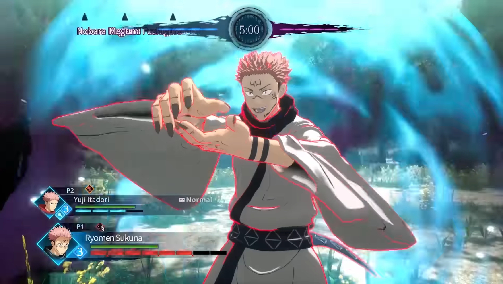

<title></title>
<head></head>
<body>
  

    <h2>A Study on <i>Jujutsu Kaisen</i> by Byking and Gemdrops: Sounds and Influences in the Game</h2>
   For my site I want to explore different sounds and influences from the game of Jujutsu Kaisen, including the anime
   <audio controls>
  <source src="horse.ogg" type="audio/ogg">
  <source src="Special.mp3" type="audio/mpeg">
</audio> 
   This sound comes from the anime itself. Most of the time, game companies like to incorporate music from the anime so the player can have a more immersive feeling in the game, especially if it's the story mode.
  in <i>The Skin Ego</i>(note 1). 
 Right down here is a small trailer for the game itself, 
 <video width="320" height="240" controls>
  <source src="JJK.mp4" type="video/mp4">
  <source src="movie.ogg" type="video/ogg">
</video> 
   As you can see, the game shows a bit of what is to come once it is finished. Gojo, who is the guy at the end talking, gives an explanation of what's going to happen in the game in the full trailer, just to inform the viewer (note 2). 
 The characters that are shown in the trailer are the ones who had the most screen time in the first season of the anime, which are the people who are more notably known than others since season 2 has recently dropped.  think again: 
  (note 3) 
   Sukuna who is the guy shown in the picture, is the first real antagonist in the show and this is a picture from a gameplay video that was shown. Which is the "fighting" mode of the game.
  

